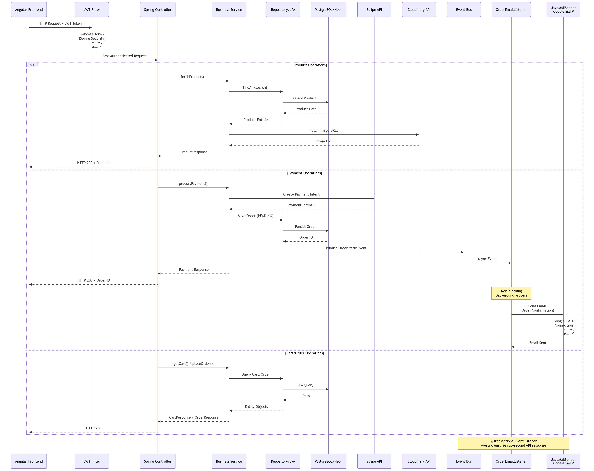
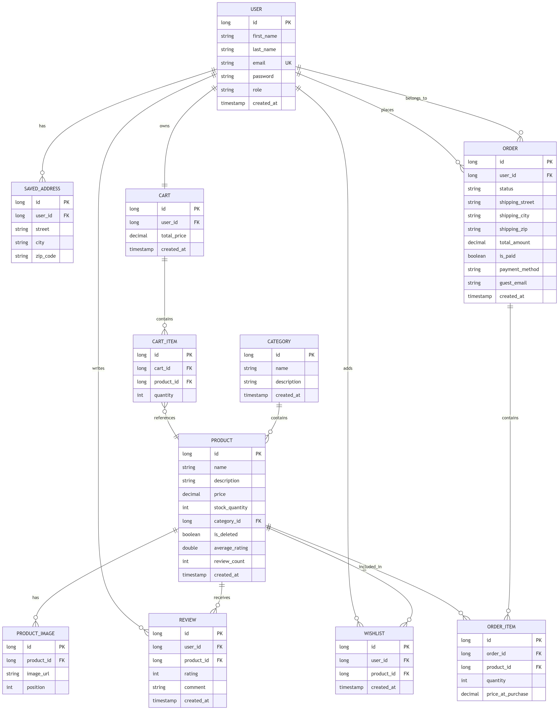

# AllMart Backend API ⚙️

[](https://spring.io/projects/spring-boot)
[](https://openjdk.org/)
[](https://neon.tech/)
[](LICENSE)

The core RESTful API and backend services for the AllMart e-commerce platform. Built with Spring Boot, the application handles secure payment processing with Stripe, stateless JWT authentication, image management with Cloudinary, and asynchronous email notifications.

---

## 🔗 Project Links

- 🌐 Live Demo: https://allmart-frontend.vercel.app
- 💻 Frontend Repository: https://github.com/sara-basta/AllMart-frontend
- 📘 Swagger API Documentation: https://allmart-backend-b364.onrender.com/swagger-ui/index.html

---

## ✨ Features

- JWT Authentication & Authorization
- Role-Based Access Control
- Stripe Checkout Integration
- Cash on Delivery Workflow
- Product & Category Management
- Cloudinary Image Uploads
- Async Email Notifications
- RESTful API Architecture
- Global Exception Handling
- DTO-Based Request/Response Structure
- Secure Spring Security Configuration

---

## 🧰 Tech Stack

| Category | Technologies |
|---|---|
| Backend | Java 21, Spring Boot 4 |
| Security | Spring Security, JWT |
| Database | PostgreSQL (Neon) |
| ORM | Spring Data JPA, Hibernate |
| Payments | Stripe API |
| Media Storage | Cloudinary |
| Email Service | JavaMailSender (Google SMTP) |
| Build Tool | Maven |

---

## 🏗️ System Architecture



### Key Architectural Decisions

- **Stateless Authentication**  
  Uses Spring Security with custom JWT filters for secure and scalable authentication.

- **Asynchronous Event Processing**  
  Implements `@TransactionalEventListener` with `JavaMailSender` to decouple email notifications from the checkout flow and maintain responsive API performance.

- **Payment Routing**  
  Supports Stripe webhook-based payments alongside traditional cash-on-delivery workflows.

- **Image Management**  
  Integrates directly with Cloudinary for optimized image hosting and delivery.

- **Layered Architecture**  
  Organized into controller, service, repository, and security layers for maintainability and scalability.

---

## 🗄️ Database Schema



### Data Persistence

- Relational mapping via **Spring Data JPA** and **Hibernate**
- Hosted on **Neon Serverless PostgreSQL**

---

## 📋 Prerequisites

Ensure the following tools are installed on your machine:

- Java Development Kit (JDK) 21+
- Maven 3.8+
- PostgreSQL or Neon Database

---

## ⚙️ Environment Configuration

Create an `application-dev.properties` file or configure the following environment variables:

```properties
# ===============================
# Database Configuration (Neon)
# ===============================
NEON_URL=jdbc:postgresql://<your-neon-host>/neondb
NEON_USERNAME=your_db_username
NEON_PASSWORD=your_db_password

# ===============================
# Security
# ===============================
JWT_SECRET=your_256_bit_base64_encoded_secret_key

# ===============================
# Frontend
# ===============================
FRONTEND_URL=http://localhost:4200

# ===============================
# Cloudinary Configuration
# ===============================
CLOUDINARY_CLOUD_NAME=your_cloud_name
CLOUDINARY_API_KEY=your_api_key
CLOUDINARY_API_SECRET=your_api_secret

# ===============================
# Stripe Configuration
# ===============================
STRIPE_SECRET_API_KEY=sk_test_your_stripe_secret
STRIPE_WEBHOOK_SECRET=whsec_your_webhook_secret

# ===============================
# Email Configuration (Google SMTP)
# ===============================
EMAIL_USERNAME=your_gmail_address@gmail.com
EMAIL_PASSWORD=your_google_app_password
```

> **Note:**  
> For Gmail SMTP integration, generate an App Password in your Google Account settings. Standard passwords are blocked by Google security policies.

---

## 🚀 Installation & Running Locally

### 1. Clone the Repository

```bash
git clone https://github.com/sara-basta/allmart-backend.git
cd allmart-backend
```

### 2. Build the Project

```bash
mvn clean install -DskipTests
```

### 3. Run the Spring Boot Application

```bash
mvn spring-boot:run
```

The API will be available at:

```text
http://localhost:8080/api/v1/
```

---

## ☁️ Deployment

| Service | Platform       |
|---|----------------|
| Backend API | Render         |
| Database | Neon PostgreSQL |
| Frontend | Vercel         |
| Image Hosting | Cloudinary     |

---

## 📦 Project Structure

```plaintext
src/main/java/com/allmart/
├── config/           # Security chains, CORS configuration, Beans
├── controller/       # REST API endpoints
├── dto/              # Data Transfer Objects
├── entity/           # JPA entities and domain models
├── exception/        # Global exception handlers
├── repository/       # Spring Data JPA repositories
├── security/         # JWT filters and authentication logic
└── service/          # Business logic and external integrations
```

---

## 📘 API Documentation

### Swagger UI

Access Swagger documentation after starting the server:

```text
http://localhost:8080/swagger-ui/index.html
```

---

## 🧪 Testing the API

You can test endpoints using Postman or cURL.

### Example: User Authentication

```bash
curl -X POST http://localhost:8080/api/v1/auth/login \
  -H "Content-Type: application/json" \
  -d '{"email":"admin@allmart.com","password":"securepassword"}'
```

### Expected Response

```json
{
  "token": "Bearer eyJhbGciOiJIUzI1NiJ9..."
}
```

---

## 🛠️ Available Maven Commands

| Command | Description |
|---|---|
| `mvn clean install` | Cleans and builds the project |
| `mvn spring-boot:run` | Runs the application locally |
| `mvn test` | Executes unit and integration tests |
| `mvn dependency:tree` | Displays dependency hierarchy |

---

## 🔐 Security Highlights

- JWT-based stateless authentication
- Password encryption with BCrypt
- Protected API routes with Spring Security
- CORS configuration for frontend integration
- Secure Stripe webhook handling
